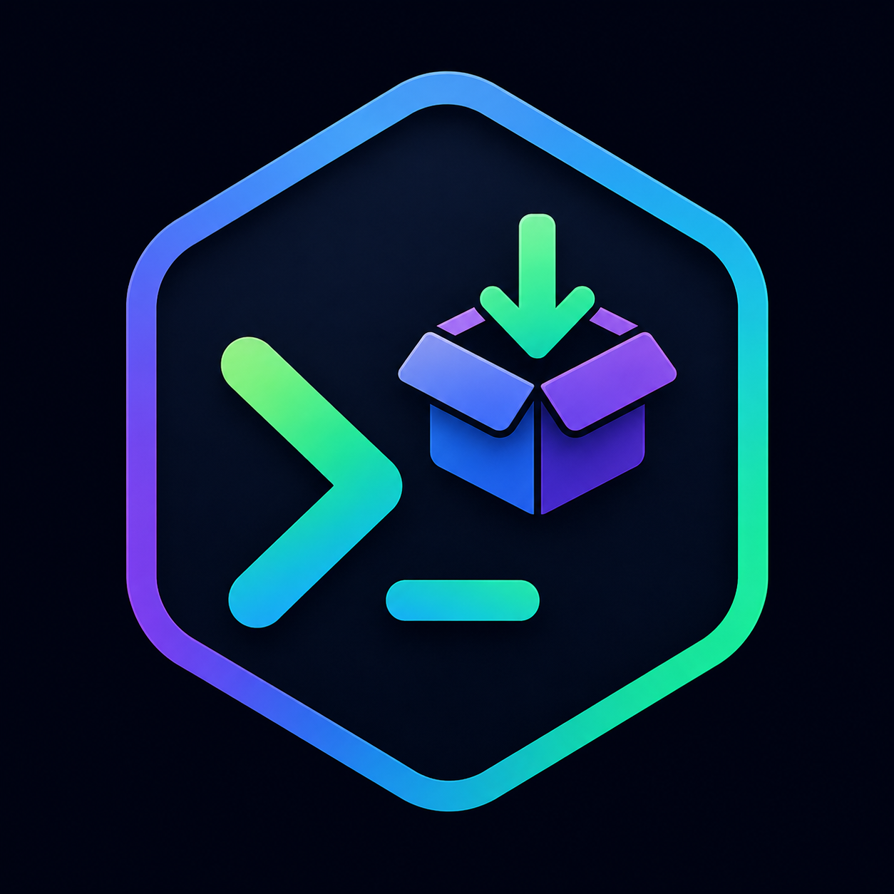

<p align="center">
  
</p>

<h1 align="center">RoleCraft for VS Code</h1>

<p align="center">
  <b>The Security-First Skill Manager for AI Agents</b><br>
  Install, manage, and discover AI agent skills from VS Code
</p>

<p align="center">
  <a href="https://github.com/rolecraft-sh/rolecraft-vscode/actions/workflows/ci.yml"></a>
  <a href="https://github.com/rolecraft-sh/rolecraft-vscode/actions/workflows/codeql.yml"></a>
  <a href="https://github.com/rolecraft-sh/rolecraft-vscode/blob/main/.github/dependabot.yml"></a>
  <a href="https://github.com/rolecraft-sh/rolecraft-vscode/releases/latest"></a>
  <a href="LICENSE"></a>
  <a href="https://github.com/rolecraft-sh/rolecraft-vscode"></a>
</p>

<p align="center">
  <a href="CHANGELOG.md"></a>
  <a href="CONTRIBUTING.md"></a>
  <a href="CODE_OF_CONDUCT.md"></a>
  <a href="SUPPORT.md"></a>
</p>

## Features

- **Skill Management** — Install, list, remove, and search skills from the sidebar
- **MCP Server Management** — Install, remove, and manage MCP servers from the sidebar
- **Profile Switcher** — Save, apply, and delete agent configuration profiles
- **SKILL.md Support** — Syntax highlighting, autocomplete, and validation
- **Security Scanning** — View security reports before installing skills

## Requirements

- [RoleCraft CLI](https://github.com/rolecraft-sh/rolecraft) installed and available in PATH
- VS Code 1.85.0 or higher

## Installation

1. Download the latest `.vsix` file from [Releases](https://github.com/rolecraft-sh/rolecraft-vscode/releases)
2. Open VS Code
3. Run `Extensions: Install from VSIX...` from the Command Palette (`Cmd+Shift+P` / `Ctrl+Shift+P`)
4. Select the downloaded `.vsix` file

## Usage

1. Open the RoleCraft sidebar (Activity Bar icon)
2. Browse installed skills in the Skills view
3. Use Command Palette (Ctrl+Shift+P) for all RoleCraft commands

## Commands

| Command                     | Description                             |
| --------------------------- | --------------------------------------- |
| `RoleCraft: Install Skill`  | Search and install skills from registry |
| `RoleCraft: Search Skills`  | Search available skills                 |
| `RoleCraft: List Skills`    | List installed skills                   |
| `RoleCraft: Remove Skill`   | Remove an installed skill               |
| `RoleCraft: Doctor`         | Run health check                        |
| `RoleCraft: Test Skill`     | Run skill tests                         |
| `RoleCraft: Init New Skill` | Create a new SKILL.md file              |
| `RoleCraft: Install MCP Server` | Search and install MCP servers       |
| `RoleCraft: Remove MCP Server`  | Remove an installed MCP server       |
| `RoleCraft: Save Profile`  | Save current configuration as a profile |
| `RoleCraft: Apply Profile` | Apply a saved profile                 |
| `RoleCraft: Delete Profile` | Delete a saved profile                 |

## Configuration

| Setting                          | Default                     | Description                  |
| -------------------------------- | --------------------------- | ---------------------------- |
| `rolecraft.executablePath`       | `rolecraft`                 | Path to RoleCraft CLI        |
| `rolecraft.autoDetectAgents`     | `true`                      | Auto-detect installed agents |
| `rolecraft.defaultAgents`        | `["cursor", "claude-code"]` | Default agents               |
| `rolecraft.showStatusBar`        | `true`                      | Show status bar item         |
| `rolecraft.autoRefresh`          | `true`                      | Auto-refresh tree views      |
| `rolecraft.securityNotification` | `warning`                   | Security notification level  |

## Development

```bash
# Install dependencies
npm install

# Compile
npm run compile

# Watch mode
npm run watch

# Lint
npm run lint

# Test
npm test

# Package
npm run package
```

## License

MIT
